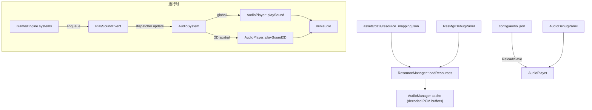

# 音频系统约定：ResourceManager / AudioManager / AudioPlayer / PlaySoundEvent（TinyFarm）

> 用途：统一项目内“音频系统”的心智模型与约定（资源映射与缓存、事件驱动播放、音乐控制、2D 空间声、以及 `config/audio.json` 调参闭环），统一项目内"音频系统"的心智模型与约定。

TinyFarm 的音频系统可以用一句话概括：
> **ResourceManager 负责把“资源 key”预加载成音频缓存；AudioPlayer 负责把缓存变成播放实例；游戏侧只需 enqueue `PlaySoundEvent`。**

---

## 1) 关键模块与职责边界

### 1.1 资源映射与预加载
- 入口：`assets/data/resource_mapping.json`
- 加载：`src/engine/resource/resource_manager.h/.cpp`（`ResourceManager::loadResources`）
- 约定：
  - `sound` / `music` 字段里的 key（例如 `ui_click`、`title-bg-music`）会被 hash 成 `entt::id_type`
  - 启动时预加载：把 key → 文件路径解码成缓存（后续播放只依赖 id，不依赖路径字符串）

### 1.2 AudioManager（解码 + 缓存）
- 入口：`src/engine/resource/audio_manager.h/.cpp`
- 职责：
  - 使用 miniaudio `ma_decoder` 将音频文件解码为 `float` PCM buffer
  - 按 `entt::id_type` 缓存 `sound` 与 `music`（播放期间通过 `shared_ptr` 保证数据不释放）

### 1.3 AudioPlayer（播放实例 + 参数）
- 入口：`src/engine/audio/audio_player.h/.cpp`
- 职责：
  - 使用 miniaudio `ma_engine/ma_sound` 创建播放实例
  - 控制：
    - sound / music 音量（`0..1`）
    - 音乐 `play/stop/pause/resume`（支持淡入/淡出）
    - 2D 空间声（距离衰减 + 声像 pan）

### 1.4 PlaySoundEvent → AudioSystem（事件驱动播放）
- 事件：`src/engine/utils/events.h`（`engine::utils::PlaySoundEvent`）
- 系统：`src/engine/system/audio_system.h/.cpp`（`engine::system::AudioSystem`）
- 语义：
  - `entity_ == entt::null`：播放“全局音效”（不做空间化）
  - `entity_ != entt::null`：尝试播放“2D 空间音效”（source=Transform；listener=Camera）

### 1.5 实体音效表（可选）：AudioComponent
- 入口：`src/engine/component/audio_component.h`
- 用途：
  - 在某些链路里，`PlaySoundEvent::sound_id_` 可能是“触发名 trigger_id”（而不是可播放的 sound id）
  - 此时通过 `AudioComponent::sounds_` 做一次 `trigger_id → resolved_sound_id` 的映射

### 1.6 调试面板
- `F5` → `Engine Debug Panels`：
  - `Audio`：调音量/空间化参数 + Reload/Save `config/audio.json` + 测试播放按钮
  - `ResMgr`：查看 sound/music 缓存条目、内存占用与时长

---

## 2) 本节视角：数据流图（Mermaid）



---

## 3) 2D 空间声模型（简化版）

TinyFarm 的 2D 空间声是一个**简化模型**：
- listener：当前相机位置 `Camera::getPosition()`
- source：事件实体的 `TransformComponent::position_`

核心直觉：
- 越远越小声（距离衰减）
- 音源在左边就偏左声道，在右边就偏右（pan）

参数（在 `config/audio.json` 与 `Audio` 面板中可调）：
- `spatial.falloff_distance`：距离衰减范围（越大，越“听得远”）
- `spatial.pan_range`：左右声像变化范围（越小，越“偏得快”）

---

## 4) `config/audio.json`（参数说明）

入口：`config/audio.json`（也可通过 `AudioPlayer::loadConfig(path)` 指定自定义路径）

结构（支持根对象包一层 `audio`）：
```json
{
  "audio": {
    "music_volume": 0.2,
    "sound_volume": 0.5,
    "spatial": {
      "falloff_distance": 320.0,
      "pan_range": 160.0
    }
  }
}
```

字段约定：
- `music_volume`：`0..1`（会被 clamp）
- `sound_volume`：`0..1`（会被 clamp）
- `spatial.falloff_distance`：`>= 0`（小于 0 会被修正为 0）
- `spatial.pan_range`：`>= 0`（小于 0 会被修正为 0）

调参闭环（推荐验证流程）：
1. `F5` → `Audio` 面板拖动参数，观察即时生效
2. 点击 `Save` 写回 `config/audio.json`
3. 重启或点击 `Reload` 验证参数持久化

---

## 5) ID 语义（key-id vs path-hash）

项目内约定优先使用“资源 key 的 hash（key-id）”：
- key：`resource_mapping.json` 里的字符串（例如 `ui_click`）
- key-id：`entt::hashed_string{key}.value()`（`entt::id_type`）

注意：
- `ResourceManager::getSound(entt::id_type id)` / `getMusic(entt::id_type id)` 更适合“只从缓存取”（不依赖路径字符串）
- `getSound(entt::hashed_string)` / `getMusic(entt::hashed_string)` 的 `hashed_string.data()` 在未命中缓存时可能会被当作 file_path 使用；
  - 如果你传入的是“语义 key”，务必确保它已通过 `resource_mapping.json` 预加载
  - 如果你传入的是“路径 hash”，则 `data()` 本身就是路径字符串（可即时加载）

---

## 6) 常见坑

1) **事件里传的 sound_id 并不总是“可播放 sound id”**
- 例如某些系统会用“触发名 trigger_id”表示“动作发生了”
- 解决：通过 `AudioComponent::sounds_` 做 `trigger_id → resolved_sound_id` 映射

2) **entity 缺 Transform / entity 已失效导致崩溃**
- 解决：AudioSystem 应做 `registry.valid + try_get<Transform>`，缺失时降级为全局音效

3) **音乐淡出不生效**
- 解决：`stopMusic(fade_out_ms)` 需要让播放实例存活到淡出完成；不要立即销毁播放对象

