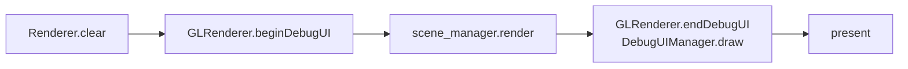

# Debug UI 指南：按键入口 / 分类管理 / 生命周期 / 输入占用（TinyFarm）

> 用途：帮助你在开发与排错时快速定位 Debug UI 的完整链路：面板从哪来、何时显示与销毁、为什么不会误触发游戏输入。

TinyFarm 的 Debug UI 可以用一句话概括：
> **`F5/F6` 只是入口；核心是 `DebugUIManager` 负责分组与生命周期，`InputManager` 负责输入占用边界。**

---

## 1) 关键模块与职责

### 1.1 GameApp：装配与帧内调用位置
- 入口：`src/engine/core/game_app.cpp`
- 职责：
  - 初始化阶段创建 `DebugUIManager` 并注册 Engine 级面板
  - 渲染阶段调用 `beginDebugUI -> scene render -> endDebugUI`
  - 在主循环里为 `dispatcher.update()` 提供 trace 作用域（区分 Immediate/Queued）

### 1.2 GLRenderer：热键入口与 ImGui 后端桥接
- 入口：`src/engine/render/opengl/gl_renderer.cpp`
- 职责：
  - 在 `handleSDLEvent` 里处理 `F5/F6`（更准确地说是 `F5 + category_index`）
  - 把 SDL 事件转发给 ImGui 后端
  - 在帧末绘制 Debug UI 覆盖层

### 1.3 DebugUIManager：分类、开关与面板生命周期
- 入口：`src/engine/debug/debug_ui_manager.h/.cpp`
- 职责：
  - 按 `PanelCategory` 管理面板（当前为 `Engine` / `Game`）
  - 绘制每个分类的 Hub Window（勾选面板开关）
  - 统一触发 `onShow/onHide`，并支持按分类整体注销

### 1.4 GameScene：Game 级面板与场景生命周期绑定
- 入口：`src/game/scene/game_scene.cpp`
- 职责：
  - `registerDebugPanels()` 注册 Game 面板（Player/GameTime/SaveLoad/MapInspector 等）
  - `clean()` 时调用 `unregisterPanels(Game)`，避免面板跨场景残留

### 1.5 InputManager：输入占用边界
- 入口：`src/engine/input/input_manager.cpp`
- 职责：
  - 读取 `ImGuiIO::WantCaptureKeyboard/WantCaptureMouse`
  - ImGui 占用输入时，阻断不应落到游戏动作层的输入映射

---

## 2) F5/F6 映射约定（分类索引驱动）

当前快捷键规则：
- `F5` -> `PanelCategory::Engine`（索引 0）
- `F6` -> `PanelCategory::Game`（索引 1）

实现方式：
- 不是硬编码 if-else，而是 `SDL_SCANCODE_F5 + category_index`
- 这要求 `PanelCategory` 的枚举顺序与可见类别顺序保持一致

工程约定：
- 新增分类时，优先在 `PanelCategory` 末尾追加
- 若重排枚举顺序，必须同步检查文档与快捷键说明

---

## 3) 一帧中的 Debug UI 位置

结论：
- Debug UI 是覆盖层，位于场景渲染之后、present 之前
- 它不是独立更新循环，不应承载玩法逻辑

---

## 4) 继承类范例：`DispatcherTraceDebugPanel`（采集层 + 展示层）

如果你只看 `DebugPanel` 抽象接口，通常会停留在“会写空壳面板”，但不清楚真实数据从哪里来。  
建议先建立下面这对协作类的关系：

- 采集层：`src/engine/debug/dispatcher_trace.h/.cpp`
- 展示层：`src/engine/debug/panels/dispatcher_trace_debug_panel.h/.cpp`

职责边界：
- `DispatcherTrace` 负责订阅 dispatcher（`watch<...>()`）、记录 Immediate/Queued 分发、提供 `recentDispatches(...)` 快照。
- `DispatcherTraceDebugPanel` 负责窗口命名与绘制（`name()/draw(bool&)`），从 `DispatcherTrace` 取数据并展示为表格。

推荐阅读顺序（最小闭环）：
1. 先看 `DispatcherTrace::watch/recentDispatches`，明确“数据如何被采集与缓存”。
2. 再看 `DispatcherTraceDebugPanel::name()`，说明它如何出现在 Hub 勾选列表里。
3. 最后看 `DispatcherTraceDebugPanel::draw(bool&)`，说明 UI 如何消费 `recentDispatches` 数据。
4. 补充说明 `onShow/onHide`：此类未重写，体现“不是每个面板都需要额外生命周期逻辑”。

运行链路（排查步骤）：
1. `GameApp` 初始化调用 `DebugUIManager::enableDispatcherTrace(...)`。
2. `DebugUIManager` 内部创建 `DispatcherTrace` 并注册要观察的事件类型。
3. 主循环在 `dispatcher.update()` 前后打点（`onDispatcherUpdateBegin/End`）。
4. `DispatcherTraceDebugPanel` 在 `draw()` 阶段读取 `recentDispatches(...)` 并可视化。

---

## 5) 输入占用细节：为什么 KEY_UP 仍要处理

常见误解：
> “ImGui 捕获键盘时，键盘事件都应该全部丢弃。”

TinyFarm 当前策略更细致：
- **阻断 `KEY_DOWN`**：避免在调试输入框打字时触发 `move/pause/...` 动作
- **保留 `KEY_UP`**：让之前已激活的动作有机会正确走到 `RELEASED/INACTIVE`

这样做的目的：
- 防止“动作卡住”或状态机残留（例如某动作已处于 `HELD`，却永远收不到释放）
- 保持输入状态机一致性（`PRESSED -> HELD -> RELEASED -> INACTIVE`）

---

## 6) 自测最小闭环（推荐）
1. `F5` 打开 `Engine Debug Panels`，勾选 `Input` 与 `Scene`
2. 进入 `GameScene`，`F6` 打开 `Game Debug Panels`，勾选 `Save/Load`
3. 聚焦 `Save/Load` 的 `Path` 输入框打字，观察玩家不移动
4. 关闭 `GameScene`（切回标题/退出），确认 Game 面板不残留

---

## 7) 常见坑
1. 只知道“按 F5 打开窗口”，不知道是哪个分类/生命周期在管理
2. 把 Debug UI 当玩法入口，导致逻辑耦合到 ImGui 控件回调
3. 粗暴屏蔽全部键盘事件，导致动作释放状态错乱
4. 场景切换时不注销 Game 面板，出现跨场景悬挂引用风险
