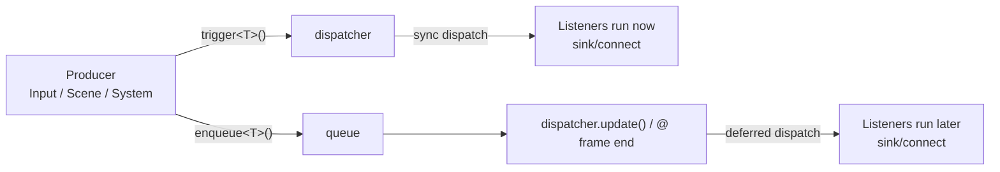

# 事件分发约定：trigger / enqueue / dispatcher.update

> 用途：统一项目内事件使用边界，避免“事件到底什么时候被处理”的误解。

本项目使用 `entt::dispatcher` 作为事件总线；核心差异是：
- `trigger<T>(...)`：**立即同步分发**，当前调用栈内就会触达所有已连接的监听者。
- `enqueue<T>(...)`：**入队**，不会立刻触发监听者；需要在之后调用 `dispatcher.update()` 才会真正分发。
- `dispatcher.update()`：处理并分发本次 update 前已入队的事件；在 TinyFarm 中，它在 `GameApp::run()` 的帧尾（`render()` 之后）被调用一次（见 `src/engine/core/game_app.cpp`），因此 **enqueue 的事件通常会在“本帧画面呈现之后”才被处理，更像是“下一帧的输入”。**

下面这张图只表达“分发时机”，不展开具体 payload：

## 项目内推荐用法
### 1) 用 trigger：需要立即生效的“控制类事件”
典型例子：
- 退出：`QuitEvent`
- 窗口大小变化：`WindowResizedEvent`
- 场景切换请求：`PushSceneEvent/PopSceneEvent/ReplaceSceneEvent`

注意：即使使用 `trigger`，监听者也可以选择“延迟执行”。例如 `SceneManager` 收到 Push/Replace 事件后不会立刻改栈，而是记录为 pending action，并在 `SceneManager::update()` 的末尾统一处理（保证切换点可控）。

### 2) 用 enqueue：允许在帧尾结算的“数据类事件”
典型例子：
- 时间推进系统产生的 `DayChangedEvent/HourChangedEvent/TimeOfDayChangedEvent`
- 游戏逻辑中批量产生的同步/刷新请求（例如某些 UI 同步请求）
- 音效/动画等“可以晚一点处理”的请求（例如 `PlaySoundEvent`）

这种事件的共同点是：它们通常在一帧内大量产生，不要求立刻改变控制流；在帧尾统一分发可让代码更稳定、也更容易避免“递归触发”的意外。

## 链路级案例
### 案例 1：trigger（退出链路：从 SDL 到主循环停止）
一个典型的窗口关闭退出路径如下（控制流事件，要求立即生效）：
1. SDL 产生 `SDL_EVENT_QUIT`（或相关窗口事件）。
2. `InputManager::processEvent()` 捕获该事件并 `trigger<QuitEvent>()`。
3. `GameApp` 监听 `QuitEvent`，在 `GameApp::onQuitEvent()` 中把 `is_running_` 置为 `false`。
4. `GameApp::run()` 的 `while (is_running_)` 退出，调用 `close()` 做清理并结束程序。

另外，项目中也可能通过其他路径触发 `QuitEvent`（例如弹出最后一个 Scene 后由 `SceneManager` 请求退出）。

### 案例 2：trigger（场景切换链路：PauseMenu 覆盖）
这是一个典型“控制流事件，但在安全点落地”的例子：
1. `GameScene` 订阅输入动作 `"pause"`，当按下暂停键时进入 `GameScene::onPauseToggle()`（见 `src/game/scene/game_scene.cpp`）。
2. `GameScene::onPauseToggle()` 创建 `PauseMenuScene`，并调用 `requestPushScene(...)`（见 `src/engine/scene/scene.cpp`）。
3. `Scene::requestPushScene()` 会 `trigger<PushSceneEvent>`；`SceneManager` 监听该事件并在 `onPushScene()` 里记录为 pending action（见 `src/engine/scene/scene_manager.cpp`）。
4. `SceneManager::update()` 的末尾调用 `processPendingActions()`，统一执行改栈，并在 push 时调用新 Scene 的 `init()`（见 `src/engine/scene/scene_manager.cpp`）。
5. 本帧 render 会叠加渲染整栈，因此 PauseMenu 可以覆盖在游戏画面之上；而下一帧 update 只更新栈顶（PauseMenu），底层游戏逻辑被冻结（见 `src/engine/scene/scene_manager.cpp`）。

> Scene 栈的调度与切换策略（update/top + render/all、Push/Pop/Replace）详见：`docs/scenes.md`

### 案例 3：enqueue（时间事件链路：TimeSystem → DayChangedEvent → 作物/地图系统）
这是一个典型“数据类事件帧尾结算”的例子（不要求立刻改变控制流，且可能在一帧内批量产生）：
1. `TimeSystem::update()` 推进时间；当跨天时 `enqueue<DayChangedEvent>()`（见 `src/game/system/time_system.cpp`）。
2. 帧尾 `GameApp::run()` 调用 `dispatcher.update()`，统一分发本帧入队的事件（见 `src/engine/core/game_app.cpp`）。
3. `CropSystem` 监听 `DayChangedEvent` 并推进作物生长（见 `src/game/system/crop_system.cpp`）。
4. `MapManager` 监听 `DayChangedEvent` 并执行“跨天”相关的地图状态更新（见 `src/game/world/map_manager.cpp`）。

> 由于 `dispatcher.update()` 在 `render()` 之后，以上第 3/4 步的处理发生在“本帧已渲染完成之后”，其结果通常会在下一帧的更新/渲染中可见。

## 订阅/取消订阅约定（connect / disconnect）
为了避免“对象已经析构，但 dispatcher 里还留着回调”的悬空调用，项目内建议遵循以下约定：
- **订阅时机**：在对象构造/初始化阶段 `connect`（例如 System 构造函数、Scene init 等）。
- **取消订阅**：在对象析构或 `close()` 中 `disconnect`（二选一，但必须保证会执行）。
- **推荐写法（断开当前对象绑定的所有回调）**：`dispatcher.disconnect(this)`（适合一个对象订阅了多个事件）。
- **精确断开某个事件**：`dispatcher.sink<Event>().disconnect<&T::method>(this)`（适合订阅很少、或需要明确控制的情况）。
