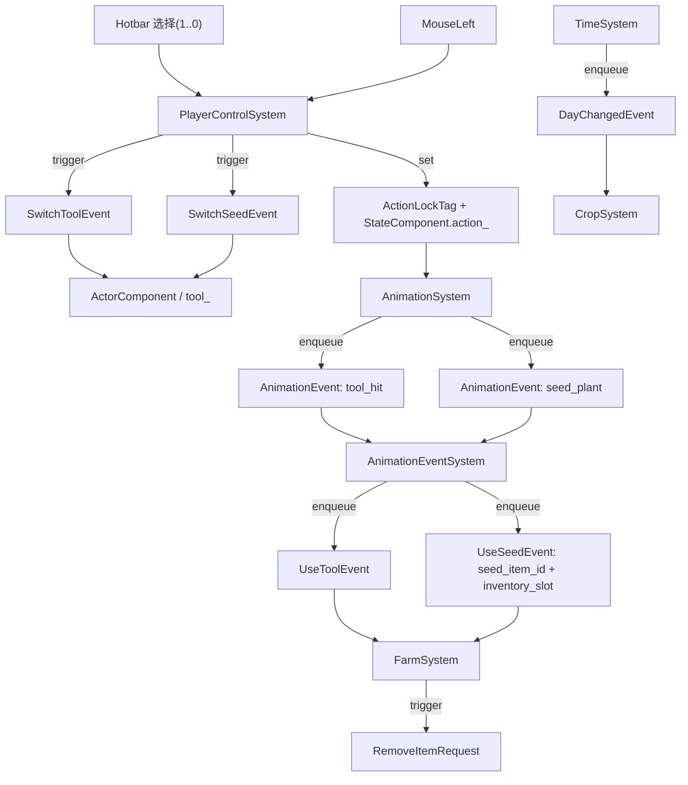

# 物品使用与农场循环：从输入到结算，再回到库存

> 用途：说明"工具/种子 → 世界结算 → 生长/收获/掉落 → 库存与 UI"的完整闭环。

## 1) 三条主链路（最重要）

> 核心直觉：**点击并不会立刻结算**。点击只是在“启动动作”，真正的玩法结算发生在**动画关键帧事件**里。

## 2) 世界状态如何表达（让系统能“靠查询协作”）

本项目用“实体 + 组件 + 空间层（spatial layer）”来表达农场世界状态：

- **耕地/湿润**：用“自动图块实体（AutoTile entity）”表示  
  - 耕地：`soil_tilled`（空间层：`SOIL`）  
  - 湿润：`soil_wet`（空间层：`WET`，通过 `AutoTileComponent.rule_id_ == SOIL_WET` 区分）  
  - 关键点：这是“世界里的状态”，不是 UI 里的一张贴图。
- **作物**：独立实体 + `CropComponent`（空间层：`CROP`）  
  - `CropComponent` 保存：作物类型、生长阶段、倒计时、种植日
  - 贴图由 `CropSystem` 根据蓝图（`crop_config.json`）切换
- **掉落物**：独立实体 + `PickupComponent`  
  - `FarmSystem` 生成掉落实体（带散射运动/拾取延迟）
  - `PickupSystem` 检测玩家碰撞后触发 `AddItemRequest`

这些状态都能被 `SpatialIndexManager` 查询到，所以系统之间不需要互相直接调用。

## 3) 回到库存：闭环的“落地点”

农场玩法最终要回到库存闭环（详见 `docs/inventory_hotbar.md`）：

- **种植成功**：`FarmSystem` 触发 `RemoveItemRequest` 扣种子
- **收获/拾取**：触发 `AddItemRequest` 把物品放入背包
- **InventorySystem** 是唯一数据源的写入口  
  - 成功/失败由它结算（并在满背包时触发 `InventoryFullEvent`）
  - 结算后触发 `InventoryChanged`（UI/Hotbar 再同步显示）

## 4) 不变量（Invariant）

1. **结算发生在动画关键帧**：点击只负责进入动作锁与播放动画；`tool_hit/seed_plant` 才是结算点。  
2. **世界状态用实体表达**：耕地/湿润/作物/掉落都在世界里“可查询”，而不是某个系统的隐藏变量。  
3. **库存是唯一数据源**：世界产出/消耗最终通过 `AddItemRequest/RemoveItemRequest` 落到 `InventorySystem`。  

## 5) 阅读线索（从闭环主线读）

1. `src/game/system/player_control_system.cpp`：hotbar 选择→持有工具/种子；左键→ActionLock+动画
2. `src/game/system/animation_event_system.cpp`：tool_hit/seed_plant → UseToolEvent/UseSeedEvent
3. `src/game/system/farm_system.cpp`：锄地/浇水/种植/收获/资源点/掉落
4. `src/game/system/crop_system.cpp`：DayChangedEvent → 生长推进/贴图更新/湿润层清理
5. `src/game/system/pickup_system.cpp` + `src/game/system/inventory_system.cpp`：掉落拾取与库存结算

