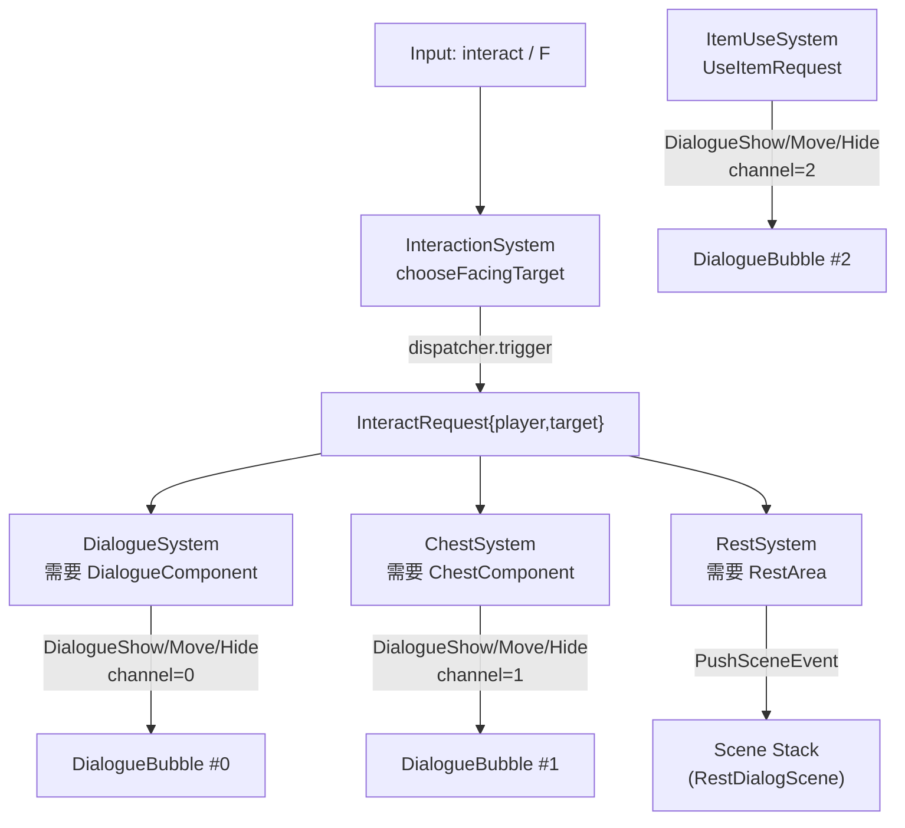

# 交互与对话：从空间查询到事件驱动 UI

> 用途：说明"按 `F` → 选目标 → 发事件 → 各系统各司其职 → UI/场景变化"的交互闭环。

## 1) 一张图：从输入到结果

核心思想：
- `InteractionSystem` **只做两件事**：根据玩家朝向做一次空间 probe，挑出“目标实体”；然后发出 `InteractRequest`。
- 具体玩法不写在 `InteractionSystem`：对话/开箱/休息分别由各自系统订阅 `InteractRequest` 并处理。
- UI 是事件驱动：气泡只监听 `DialogueShow/Move/HideEvent`，并按 `channel` 区分不同用途，避免互相覆盖。

## 2) InteractRequest：事件总线式扩展点

当你想加一种新的“可交互物”（例如：告示牌、钓鱼点、商店入口）：
1. 给实体加一个能识别它的 component（例如 `SignboardComponent`）
2. 新建一个系统订阅 `InteractRequest`
3. 在回调里判断 `event.target` 是否带该 component，然后处理并驱动 UI/Scene

这样做的收益是：
- `InteractionSystem` 保持稳定，不会随着玩法增加而“越改越大”
- 新交互=新增订阅者，代码耦合更低

## 3) DialogueBubble 的 channel 约定

项目里约定使用 3 个频道（见 `GameScene::initUI`）：
- `0`：对话（NPC 说话）
- `1`：通知（例如拾取/开箱等短提示）
- `2`：物品提示（例如物品栏右键使用后的提示）

因此，系统在发 `DialogueShow/Move/HideEvent` 时必须带上对应 `channel`，才能路由到正确的气泡实例。

