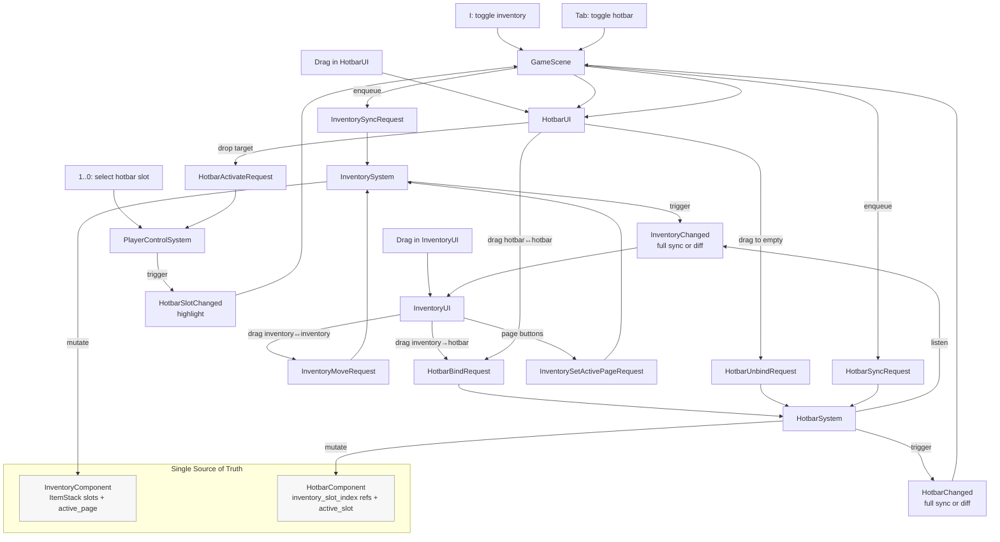

# 物品栏与快捷栏：UI 同步、拖拽映射与状态一致性

> 用途：说明 Inventory/Hotbar 的数据模型、Request/Changed 事件链路、以及拖拽/绑定的一致性规则。

## 1) 一张图：从输入到 UI 更新

## 2) 核心不变量（Invariant）

1. **Inventory 是唯一数据源（Single Source of Truth）**  
   `InventoryComponent` 保存 `ItemStack{item_id,count}`；所有增删/移动/合并都在 `InventorySystem` 中发生。

2. **Hotbar 是“引用”（reference），而不是第二份物品数据**  
   `HotbarComponent` 的每个槽位只保存 `inventory_slot_index_`，指向某个 inventory slot；不保存 `ItemStack`。

3. **UI 发 Request，System 发 Changed（单向数据流）**  
   UI 层只发 `*Request`（例如 `InventoryMoveRequest/HotbarBindRequest`）；System 改组件后发 `*Changed`（例如 `InventoryChanged/HotbarChanged`），UI 只根据事件更新显示。

4. **一个 inventory slot 最多绑定到一个 hotbar slot**  
   这条规则由 `HotbarSystem::onBind` 保证：如果某个 inventory slot 已经绑定到别的 hotbar slot，新的 bind 会先解绑旧位置（相当于“移动快捷键”）。

## 3) 一致性规则：拖拽/移动/合并时 hotbar 应该怎么变？

本项目的取舍是：**hotbar 尽量“跟随物品”而不是“跟随槽位”**。  
因此当 inventory 内发生 move/swap/merge 时，会同步调整 `HotbarComponent` 的 `inventory_slot_index_`，让 hotkey 尽量仍指向“原先那个物品堆”。

一个典型边界情况是 **merge（合并堆叠）**：
- source 槽位合并进 target 后，source 变空
- 若 target 也被 hotkey 引用，则不能简单 swap 映射（会把 target 的 hotkey 换到空槽位）
- 当前规则（Rule A）：**保留 target(to) 的 hotkey，清空 source(from) 的 hotkey**

## 4) 阅读线索（定位到代码）

- 数据模型：
  - `src/game/component/inventory_component.h`
  - `src/game/component/hotbar_component.h`
- 事件契约：
  - `src/game/defs/events.h`
- System：
  - `src/game/system/inventory_system.cpp`（move/swap/merge + InventoryChanged）
  - `src/game/system/hotbar_system.cpp`（bind/unbind/sync + HotbarChanged）
  - `src/game/system/player_control_system.cpp`（数字键切换 + HotbarSlotChanged）
- UI/装配：
  - `src/game/ui/inventory_ui.cpp`（缓存 + InventoryChanged）
  - `src/game/ui/hotbar_ui.cpp`（拖拽语义与请求）
  - `src/game/scene/game_scene.cpp`（sync 请求与 UI 更新）

