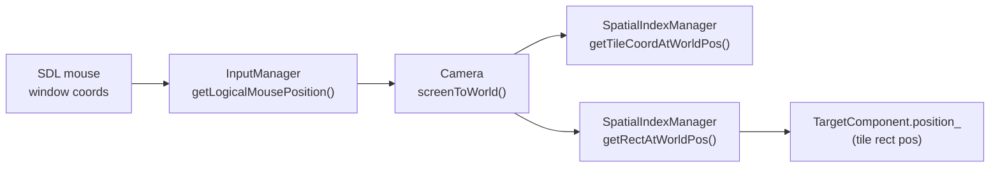

# 玩家控制与相机（PlayerControlSystem / CameraFollowSystem）约定与排错

> 用途：统一"输入→玩家意图→目标选择→动作事件→相机"的心智模型，并提供常见问题排查入口。

---

## 1) 关键模块与职责边界

### 1.1 `InputManager`：只做“输入→动作状态”
- 入口：`src/engine/input/input_manager.h/.cpp`、配置：`config/input.json`
- 提供：
  - 动作状态机：`isActionDown/isActionPressed/isActionReleased`
  - 回调：`onAction(action, state).connect(...)`
  - 鼠标：`getLogicalMousePosition()`、`getMouseWheelDelta()`

### 1.2 `PlayerControlSystem`：把“动作状态”翻译成“玩家意图”
- 入口：`src/game/system/player_control_system.h/.cpp`
- 典型落点：
  - 移动：写 `VelocityComponent`
  - 动画状态：写 `StateComponent` + `StateDirtyTag`
  - 当前选择：写 `ActorComponent`（tool/seed）
  - 目标格可视化：写 `TargetComponent` + `InvisibleTag`
  - 动作锁：`ActionLockTag`（锁定期间不移动/不刷新目标格，保证动画命中稳定）

### 1.3 `CameraFollowSystem`：相机跟随/缩放
- 入口：`src/game/system/camera_follow_system.h/.cpp`
- 输入：
  - 滚轮：`InputManager::getMouseWheelDelta()`
  - 重置缩放：`camera_reset_zoom`
- 输出：修改 `Camera`（位置/zoom），并由 `Camera` 自己 clamp（min/max/limit bounds）

### 1.4 `RenderTargetSystem`：把目标格画出来
- 入口：`src/game/system/render_target_system.h/.cpp`
- 读取 `TargetComponent`（排除 `InvisibleTag`）绘制一个 tile 大小的矩形

### 1.5 `AnimationEventSystem`：动作关键帧 → 玩法事件
- 入口：`src/game/system/animation_event_system.cpp`
- 在 `"tool_hit"` / `"seed_plant"` 等关键帧 enqueue：
  - `UseToolEvent`
  - `UseSeedEvent`

---

## 2) 坐标系转换（最容易错的链路）

核心原则：
> **不要把 SDL 的 window coords 当成逻辑坐标，更不要直接当成 world 坐标。**

快速对照：
- window → logical：`InputManager`（letterbox 映射 + clamp）
- logical → world：`Camera::screenToWorld`（受 camera position/zoom 影响）
- world → tile/rect：`SpatialIndexManager`

---

## 3) 常用动作（Action）清单

入口：`config/input.json`
- 移动：`move_up/down/left/right`
- 交互：`interact`
- UI：`inventory`、`hotbar`
- 快捷栏：`hotbar_1..hotbar_10`
- 相机：`camera_reset_zoom`

---

## 4) 常见问题排查清单

### 4.1 鼠标指向的格子与目标框不一致 / 有明显偏移
1. 确认使用的是 `getLogicalMousePosition()`（而不是 SDL 原始坐标）
2. 确认用 `Camera::screenToWorld()` 做了转换（特别是缩放后）
3. 若窗口有 letterbox：重点排查 `InputManager::recalculateLogicalMousePosition` 的映射（window size vs logical size）

### 4.2 目标框不出现
1. 目标框显示依赖“有选择”：`ActorComponent.tool_ != None` 或 `hold_seed_ != Unknown`
2. 目标框显示依赖“范围门控”：`TOOL_TARGET_TILE_RANGE`（鼠标 tile 必须在玩家附近）
3. 若玩家处于 `ActionLockTag`：目标框会保持当前状态但不刷新（避免动画命中位置抖动）

### 4.3 左键点击没有触发动作
1. 若 `ActionLockTag` 存在：点击会被忽略（动作锁期间只等待动画驱动的命中事件）
2. 若鼠标超出范围：目标解析失败，会直接 return
3. 若 UI 吃掉输入：检查 UI 是否占用 `mouse_left`（参见 `docs/input_system.md` 的“占用/转发规则”）

### 4.4 相机缩放/边界表现异常
1. 缩放 clamp：检查 `Camera::min_zoom/max_zoom`
2. 边界 clamp：检查 `Camera::limit_bounds`（通常由 `MapManager::configureCamera` 设置）
3. 如果边界区域小于视口：`Camera` 会把位置钉在边界中心（防止抖动）

