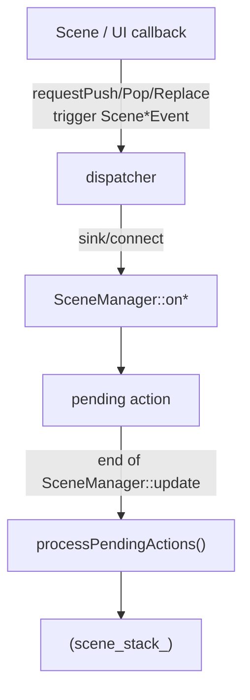

# Scene 系统约定：Scene 栈、生命周期与切换策略

> 用途：统一项目内 Scene 栈的使用边界与切换时机，避免“什么时候切换/切换后这一帧会发生什么”的误解。

TinyFarm 的 Scene 系统由两部分组成：
- `engine::scene::Scene`：场景基类，承载生命周期与“场景内状态”（UI、Registry 等）
- `engine::scene::SceneManager`：场景栈管理器，负责 update/render 调度与 push/pop/replace 的落地

---

## 1) Scene 栈的核心约定：update 只更新栈顶，render 叠加渲染整栈
`SceneManager` 对场景栈的调度规则是：
- `update()`：只更新栈顶（current/top）场景
- `render()`：从栈底到栈顶依次渲染（叠加渲染）

这样做的直接收益是：
- **覆盖式 Scene（PauseMenu/模态对话框）** 可以冻结底层逻辑（底层 Scene 不再 update）
- 同时仍能显示底层画面（底层 Scene 仍会 render），覆盖层 Scene 的 UI 叠在上面

对应实现线索：
- `src/engine/scene/scene_manager.cpp`：`SceneManager::update()` / `SceneManager::render()`

---

## 2) Scene 的生命周期：init / update / render / clean
在本项目中，一个 Scene 的生命周期接口含义约定为：
- `init()`：一次性初始化（创建 UI、注册输入/事件回调、初始化 registry 等）
- `update(dt)`：每帧更新（仅栈顶会被调用）
- `render()`：每帧渲染（整栈都会被调用，用于叠加）
- `clean()`：退出/弹出前的清理（清空 registry、释放 UI、取消订阅等）

常见线索：
- `src/engine/scene/scene.h/.cpp`：基类实现与 `requestPush/Pop/Replace/Quit`
- `src/game/scene/*.cpp`：不同场景的 UI 初始化与交互回调

---

## 2.5) Scene 与 ECS 的边界：Scene 拥有 registry（场景级状态隔离）
TinyFarm 的一个关键约定是：**每个 Scene 都拥有自己的 `entt::registry`**（见 `engine::scene::Scene::registry_`）。

这意味着：
- Scene 切换/叠加，本质上是在切换/叠加不同的“ECS 世界”（不同的实体与组件集合）。
- `clean()` 是场景级状态边界：清理后，registry 内实体/组件，以及 `registry.ctx()` 中放入的场景级共享数据都不应再被使用。

一个实用的工程化问题是：覆盖式 Scene（例如 PauseMenu）可能需要读取/修改底层场景的一些“场景级共享数据”。
推荐思路有两种（按优先级）：
1. **用事件表达意图**：PauseMenu 发请求事件，由底层系统在安全点落地（更解耦）。
2. **显式传入必要数据的非拥有引用/指针**：在 push 覆盖层时，把底层场景的关键数据指针传给覆盖层（需要保证生命周期）。

项目中的真实例子（第 2 种）：
- `GameScene` 把时间数据放入自己的 `registry.ctx()`：`registry_.ctx().emplace<game::data::GameTime>(...)`
- `GameScene` push `PauseMenuScene` 时取出指针并传入：`auto* game_time = registry_.ctx().find<game::data::GameTime>();`
- `PauseMenuScene` 持有 `game::data::GameTime*`（non-owning），用于调整时间缩放等设置

对应线索：
- `src/game/scene/game_scene.cpp`：`initRegistryContext()`、`onPauseToggle()`
- `src/game/scene/pause_menu_scene.h/.cpp`：`game_time_` 的使用

---

## 3) 切换策略：Push / Pop / Replace 应该怎么选？
从“用户体验/工程语义”上，我们把切换分成三种：
- `Replace`：**大切换**（标题 → 游戏、游戏 → 标题），旧栈被清空，新的主场景成为唯一栈顶
- `Push`：**覆盖**（暂停菜单、存档选择、模态确认框），新场景压栈盖在旧场景之上
- `Pop`：**关闭覆盖层**（Resume/Back/Cancel），弹出栈顶，回到下一个场景

你可以把它记成一句话：
> **Replace 用于“换主流程”，Push/Pop 用于“加/关一层覆盖”。**

项目中的真实例子：
- `src/game/scene/title_scene.cpp`：Start → `ReplaceScene(GameScene)`；Load → `PushScene(SaveSlotSelectScene)`
- `src/game/scene/game_scene.cpp`：Pause → `PushScene(PauseMenuScene)`
- `src/game/scene/pause_menu_scene.cpp`：Resume → `PopScene`；Title → `ReplaceScene(TitleScene)`

---

## 4) “先表达意图，后在安全点落地”：pending actions 的原因与时机
项目约定：Scene 不直接操作 `SceneManager`，而是通过事件表达切换意图：
- `Scene::requestPushScene/Pop/Replace` 内部会 `trigger<Push/Pop/ReplaceSceneEvent>()`
- `SceneManager` 监听这些事件，但不会立刻改栈，而是记录为 pending action
- 在 `SceneManager::update()` 的末尾调用 `processPendingActions()` 统一落地切换

这样做的原因是：避免在 update 的中途改栈导致的递归/时序不确定性，让切换点可控。

简化数据流如下：

一个关键细节：切换发生在 `update()` 末尾，因此：
- 新 push 的 Scene **本帧不会 update**（update 已结束），但 **可能参与本帧 render**（render 在之后执行）
- pop/replace 会影响本帧 render（因为 render 使用切换后的栈）

实现线索：
- `src/engine/scene/scene_manager.cpp`：`onPush/onPop/onReplace` + `processPendingActions`
- `src/engine/core/game_app.cpp`：主循环中调用 `scene_manager.update()` / `scene_manager.render()`

---

## 5) 订阅/取消订阅：Scene 生命周期与回调安全
Scene 往往会订阅两类回调：
- `InputManager::onAction(...).connect(...)`（输入动作）
- `dispatcher.sink<Event>().connect(...)`（事件监听）

为了避免“Scene 已销毁，但回调仍存在”的悬空调用，建议：
- 在 `init()` 中订阅
- 在析构或 `clean()` 中取消订阅（二选一，但必须确保会执行）
- 多事件订阅时可用：`dispatcher.disconnect(this)`

参考线索：
- `src/game/scene/game_scene.cpp`：析构时统一 disconnect 输入与事件
- `src/game/scene/pause_menu_scene.cpp` / `src/game/scene/save_slot_select_scene.cpp`：订阅与取消订阅示例
