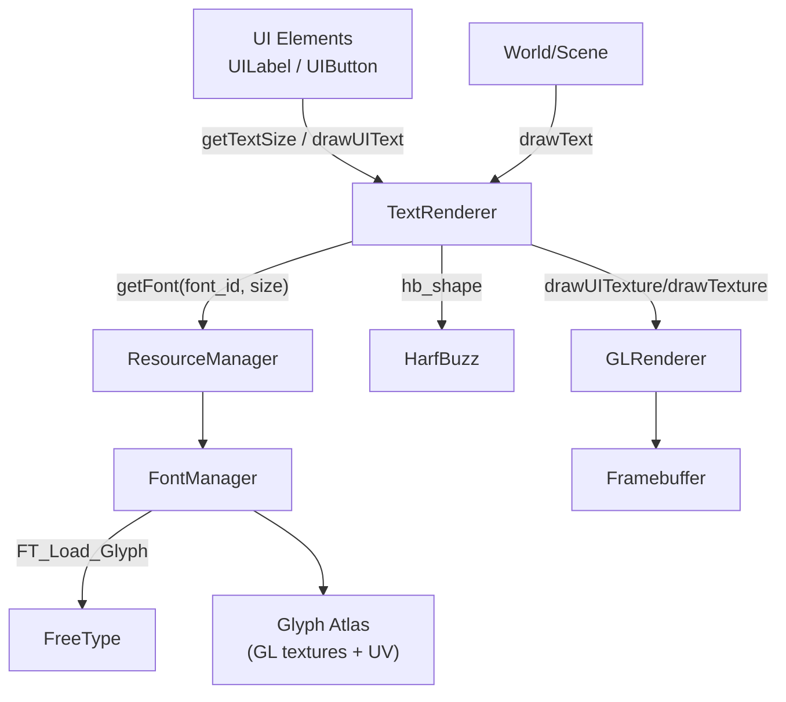

# 文本渲染约定：FontManager / TextRenderer / 样式配置（TinyFarm）

> 用途：统一项目内“字体与文本渲染”的心智模型与约定（FreeType/HarfBuzz 分工、三层缓存、配置与调试入口），统一项目内"字体与文本渲染"的心智模型与约定。

TinyFarm 的文本渲染可以用一句话概括：
> **FontManager 负责“把 glyph 变成可采样的 atlas”，TextRenderer 负责“把 UTF-8 变成 glyph 布局并画到屏幕”。**

---

## 1) 关键模块与职责边界

### 1.1 FontManager（字体与字形缓存）
- 入口：`src/engine/resource/font_manager.h/.cpp`
- 核心类型：
  - `engine::resource::FontManager`：按 `(font_id, pixel_size)` 缓存 `Font`
  - `engine::resource::Font`：封装 FreeType `FT_Face` + HarfBuzz `hb_font_t`，并维护字形缓存与 atlas 页
  - `engine::resource::FontGlyph`：单个字形的纹理页句柄、尺寸、bearing、advance、uv_rect

职责：
- FreeType 加载字体文件并渲染 glyph 位图（按需）
- 把 glyph 位图写入 glyph atlas（OpenGL texture），并输出 `uv_rect` 给渲染器采样

### 1.2 TextRenderer（文本整形、布局缓存与绘制）
- 入口：`src/engine/render/text_renderer.h/.cpp`
- 核心类型：
  - `engine::render::TextRenderer`：面向上层的文本渲染外观层
  - `TextLayout`：一次排版结果（glyph placements + size）
  - `LayoutKey`：布局缓存键（font_id/font_size/text/layout_options）

职责：
- HarfBuzz 整形：`UTF-8 文本 → glyph 序列 + 每个 glyph 的 advance/offset`
- 布局缓存：避免重复 shaping/布局计算
- 绘制：把 glyph placement 转为 `GLRenderer::drawUITexture/drawTexture` 调用

### 1.3 ResourceManager（统一资源入口）
- 入口：`src/engine/resource/resource_manager.h/.cpp`
- 字体接口：`ResourceManager::getFont(...)`

职责：
- 统一字体缓存入口（内部委托给 `FontManager`）
- 在字体卸载/清理时 enqueue 事件，驱动 `TextRenderer` 做缓存失效（避免悬挂布局）

相关事件：
- `src/engine/utils/events.h`：`FontUnloadedEvent` / `FontsClearedEvent`

---

## 2) 数据流：从“文本字符串”到“屏幕像素”

两条绘制通路：
- **UI 文本**：`TextRenderer::drawUIText(...)` → `GLRenderer::drawUITexture(...)`（屏幕空间/UI pass）
- **世界文本**：`TextRenderer::drawText(...)` → `GLRenderer::drawTexture(...)`（受相机影响/world pass）

---

## 3) 三层缓存（以及它们的代价）

### 3.1 Font cache（字体文件级）
- 键：`(font_id, pixel_size)`
- 值：`Font`（FT_Face + hb_font + 字体度量信息）

### 3.2 Glyph cache + Atlas（字形级）
- 键：`glyph_index`
- 值：`FontGlyph`（atlas 纹理句柄 + uv_rect + metrics）
- 代价：atlas 页会增长，显存/内存预算会随“新字符出现”而增加

### 3.3 Layout cache（文本排版级）
- 键：`(font_id, font_size, text, layout_options)`
- 值：`TextLayout`（glyph placements + size）
- 代价：缓存越大越省 CPU，但占用更多内存；容量由配置控制（见下节）

失效机制：
- `ResourceManager::unloadFont/clearFonts` 会 enqueue 事件
- `TextRenderer` 监听 `FontUnloadedEvent/FontsClearedEvent` 清理对应布局缓存
- 文本样式/布局参数变化会递增 `layout_revision`，UI 组件可据此重新测量尺寸

---

## 4) 样式配置：`config/text_render.json`

入口：
- `src/engine/render/text_renderer.h`：`TextRenderer::DEFAULT_CONFIG_PATH`
- `src/engine/render/text_renderer.cpp`：`TextRenderer::loadConfig(...)`

核心字段：
- `direction`：文本方向（`ltr/rtl/ttb/btt`）
- `language`：BCP-47 语言标签（例如 `zh-Hans`）
- `features`：HarfBuzz 特性字符串（例如 `kern=1`）
- `layout_cache_capacity`：布局缓存容量
- `default_style_keys`：默认样式 key（`ui`/`world`）
- `styles`：样式表（key → `color/shadow/layout`）

样式参数结构：
- `color`：单色/渐变（`start_color/end_color/use_gradient/angle_*`）
- `shadow`：阴影开关/偏移/颜色
- `layout`：字距/行距缩放/字形缩放（`letter_spacing/line_spacing_scale/glyph_scale`）

---

## 5) 调试与排查

### 5.1 `Resource` 面板：看“字体是否在涨、涨多少”
- 入口：运行后按 `F5` → `Engine Debug Panels` → `Resource`
- 重点关注：
  - Fonts 条目数（不同 size 视为不同字体实例）
  - glyph 数与 atlas 页数
  - 估算内存（atlas 往往是主要成本）

### 5.2 `Text` 面板：实时调样式与布局
- 入口：运行后按 `F5` → `Engine Debug Panels` → `Text`
- 用途：
  - 调 `ui/*` 与 `world/*` 样式（颜色/阴影/字距/缩放）
  - 验证 `layout_revision` 触发 UI 重新测量（避免“文字变了但控件尺寸不变”）

---

## 6) 常见坑

1) **字体未预加载就绘制失败**
- `TextRenderer::drawTextInternal()` 内部不会携带 `font_path`，因此如果字体不在缓存中，会失败并给出提示日志。
- UI 侧通常通过先调用 `getTextSize(..., font_path)` 来触发字体加载（例如 `UILabel`）。

2) **glyph/atlas 会随新字符增长（文本不是免费的）**
- UI/对话/日志里出现的新字符都会触发 glyph 加载与 atlas 写入；应通过 `Resource` 面板建立“预算”直觉。

3) **UI/world pass 坐标不同**
- UI 文本是屏幕空间；世界文本受相机影响。排查“位置不对/抖动/被裁剪”时先确认走的是哪条通路。

