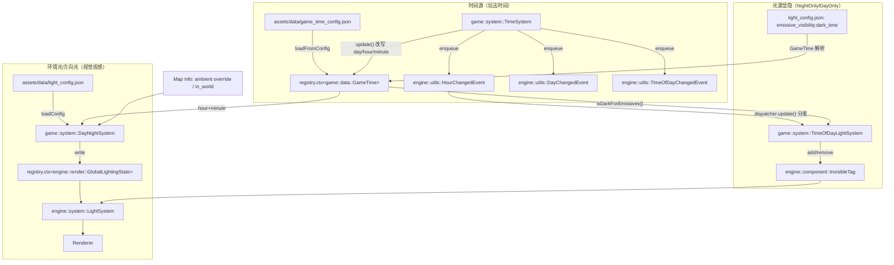

# 时间与光照（Time + Lighting）总览

> 用途：用一张图展示三条链路，并明确三类配置的职责边界，避免"玩法时段 / 视觉昼夜 / 光源显隐"混在一起导致的隐性不一致。

## 1) 三条链路（一张图）

说明：
- TinyFarm 默认把 `dispatcher.update()` 放在 `render()` 之后；因此 `enqueue` 的事件通常在**下一帧**才被分发。
- 这也是为什么 `TimeOfDayLightSystem` 做成“事件驱动”后，不需要每帧 `update()`。

## 2) 概念区分：`TimeOfDay::Night` vs `isDarkForEmissives()`

为了避免“同一个词多套阈值”导致的困惑，本项目明确区分两类概念：

- **玩法时段（TimeOfDay）**
  - 定义位置：`assets/data/game_time_config.json`（dawn/day/dusk/night）
  - 影响对象：UI 展示、AI/日程、玩法逻辑（通过 `TimeOfDayChangedEvent`）
  - 入口逻辑：`game::data::GameTime::calculateTimeOfDay(...)`

- **视觉暗时段（Emissive dark time）**
  - 定义位置：`assets/data/light_config.json` 的 `emissive_visibility.dark_time`
  - 影响对象：带 `NightOnlyTag/DayOnlyTag` 的光源实体显隐（`InvisibleTag`）
  - 入口逻辑：`game::data::GameTime::isDarkForEmissives()`

它们允许不一致（例如：玩法 Night=20→4，但路灯可以 18→6 提前亮、延后灭），但这种不一致应该是**有意设计**而不是“代码里 hardcode 漏改”。

## 3) 配置边界（谁管什么）

- `assets/data/game_time_config.json`
  - 管：时间流逝速度（minutes_per_real_second）、玩法时段划分（time_periods）
  - 不管：太阳/月亮/环境光的颜色与过渡、路灯显隐策略

- `assets/data/light_config.json`
  - 管：太阳/月亮过渡（transition_periods）、环境光关键帧（ambient.keyframes）
  - 也管：`emissive_visibility.dark_time`（只用于 NightOnly/DayOnly 光源显隐）
  - 不管：玩法中的 `TimeOfDay` 划分与速度

- 地图 `ambient` override（室内/特殊区域）
  - 管：某张地图是否覆盖环境光（常见于室内），与昼夜无关
  - 入口逻辑：`DayNightSystem::update()` 从 `WorldState` 读取 map info

## 4) 关键文件定位（读代码时从这里入手）

- 时间数据与配置：`src/game/data/game_time.h`, `src/game/data/game_time.cpp`
- 时间推进与事件：`src/game/system/time_system.h`, `src/game/system/time_system.cpp`
- 环境光（太阳/月亮/ambient）：`src/game/system/day_night_system.h`, `src/game/system/day_night_system.cpp`
- 光源显隐（NightOnly/DayOnly）：`src/game/system/time_of_day_light_system.h`, `src/game/system/time_of_day_light_system.cpp`
- 地图加载时的初始显隐：`src/game/loader/entity_builder.cpp`
- 引擎光照提交与渲染：`src/engine/system/light_system.cpp`, `src/engine/render/lighting_state.h`

## 5) 快速排错 checklist

- 路灯不随时间变化：
  - `TimeSystem` 是否在跑？`GameTime.paused_` 是否为 true？
  - 是否产生了 `HourChangedEvent`（注意它是 `enqueue`，需要 `dispatcher.update()` 才会分发）
  - 光源实体是否同时具备：
    - `NightOnlyTag` 或 `DayOnlyTag`
    - 任一光源组件（Point/Spot/EmissiveRect/EmissiveSprite）

- 室内环境光不对：
  - 地图是否设置了 `ambient` override？
  - `in_world=false` 的地图应禁用太阳/月亮方向光（只保留室内 ambient）

