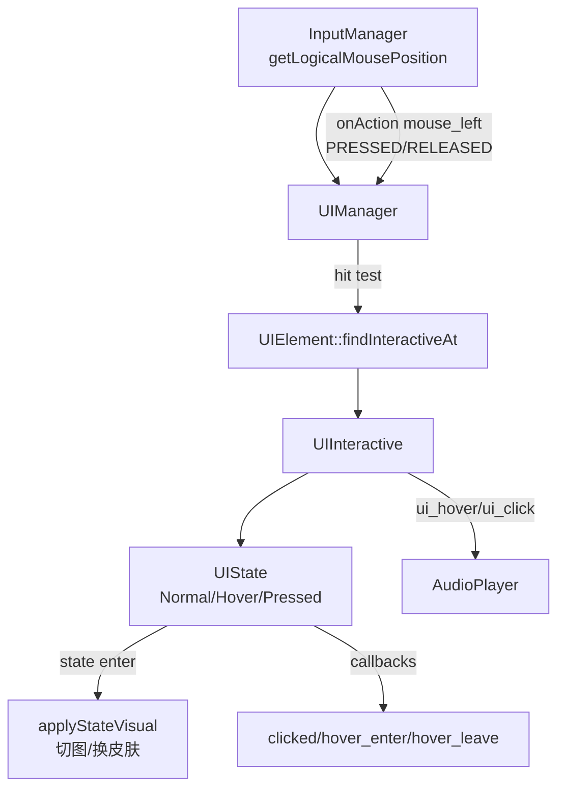

# UI 框架约定：UIManager / UIElement Tree / Layout / UIInteractive（TinyFarm）

> 用途：统一项目内“UI 框架”的心智模型与约定（UI 的挂载点、元素树、布局模型、交互状态机、与 Input/Audio 的连接点），统一项目内"UI 框架"的心智模型与约定。

TinyFarm 的 UI 框架可以用一句话概括：
> **每个需要 UI 的 Scene 自己持有一个 `UIManager`；UIManager 管理一棵 `UIElement` 树，并把输入（logical mouse）翻译成 hover/press/release 状态机与声音反馈。**

---

## 1) 关键模块与职责边界

### 1.1 Scene：UI 的挂载点（生命周期）
- 入口：`src/engine/scene/scene.h/.cpp`
- 约定：
  - `Scene` 基类持有 `std::unique_ptr<engine::ui::UIManager> ui_manager_`（可选）
  - `Scene::update/render` 会在 `ui_manager_` 存在时调用 `ui_manager_->update/render`
  - `SceneManager` 只 update 栈顶场景，但 render 会叠加渲染整个栈（PauseMenu/对话框覆盖在底层画面之上）

### 1.2 UIManager：每场景 UI 管理器
- 入口：`src/engine/ui/ui_manager.h/.cpp`
- 职责：
  - 维护根节点 `UIPanel(root)`，所有 UI 元素作为其子树
  - 每帧处理 hover（轮询鼠标位置 + hit test）
  - 监听 `mouse_left` 的 `PRESSED/RELEASED` 动作回调，驱动 press/release（并通过 `bool` 返回值“吃掉输入”）
  - 负责 UI 渲染调用（递归 render）以及可选的自定义鼠标指针绘制

### 1.3 UIElement：元素树 + 布局模型
- 入口：`src/engine/ui/ui_element.h/.cpp`
- 职责：
  - 树结构：`parent_` + `children_`（`addChild/removeChild/removeAllChildren`）
  - 布局缓存：`layout_position_/layout_size_`，用 `layout_dirty_` 做惰性更新
  - 命中检测：`findInteractiveAt(point)`（从后往前遍历子节点，优先命中“更上层”的元素）

### 1.4 UIInteractive：交互基类（状态机 + 声音）
- 入口：`src/engine/ui/ui_interactive.h/.cpp`
- 职责：
  - 管理交互状态（`UIState`）：`Normal/Hover/Pressed`
  - 把 `mouseEnter/mouseExit/mousePressed/mouseReleased` 转换成状态切换与回调（`hover_enter/clicked`）
  - 默认播放 UI 音效：
    - hover：`ui_hover`
    - click：`ui_click`
  - 支持事件音效覆盖：`sound_overrides_[event_id] = sound_id`（`entt::null` 表示禁用）

### 1.5 UIButton：典型可交互控件
- 入口：`src/engine/ui/ui_button.h/.cpp`
- 职责：
  - 基于 `UIInteractive` 实现按钮：状态 → 皮肤/文本样式 → 回调
  - 支持 UI preset（详见第 9 节）

### 1.6 UIInputBlocker：模态 UI 的“点击阻断”
- 入口：`src/engine/ui/ui_input_blocker.h/.cpp`
- 用途：
  - 全屏透明 `UIInteractive`，用于阻止点击穿透（对话框/暂停菜单背后不应触发世界操作）

---

## 2) 坐标系约定：UI 使用 logical 坐标

UI hit-test 与绘制都使用 **logical 坐标系**（与渲染逻辑分辨率一致）：
- 输入来源：`InputManager::getLogicalMousePosition()`（见 `docs/input_system.md`）
- UI 元素的 `position_/size_` 都以 logical 单位表达

这保证在 letterbox / 高 DPI / 窗口缩放下：
> UI 的命中与渲染不会漂移（不会把 window coords 当成 UI coords 用）。

---

## 3) 布局模型（UIElement::ensureLayout 的核心直觉）

UIElement 的定位由这些字段共同决定：
- `position_`：相对父元素的局部偏移（基于 anchor_min）
- `anchor_min_ / anchor_max_`：把父元素 content bounds 的某个归一化点作为锚点；若两者不相等则意味着“拉伸”
- `pivot_`：自身的归一化枢轴（决定 layout_position 是左上角/中心等）
- `padding_`：影响子元素的 content bounds（父内容区域）
- `margin_`：影响自身的位置/可用空间
- `order_index_`：子元素排序（同时影响渲染顺序与 hit test 优先级）

简化版（示意）：
```text
parent_content = parent.getContentBounds()
anchor_min_pos = parent_content.pos + parent_content.size * anchor_min
anchor_max_pos = parent_content.pos + parent_content.size * anchor_max

if stretched:
  layout_size = (anchor_max_pos - anchor_min_pos) - margin
else:
  layout_size = requested size

anchor_reference = anchor_min_pos + position
layout_position = anchor_reference + margin.left/top - layout_size * pivot
```

---

## 4) 交互链路：Input → UIManager → UIInteractive(UIState) → Audio



占用/转发规则（与 `docs/input_system.md` 一致）：
- `InputManager::onAction` 的回调返回 `bool`
- UI 若“吃掉输入”，应返回 `true` 阻止后续订阅者（世界/系统）收到同一动作

---

## 5) 资源与默认音效约定

默认 UI 音效 key：
- hover：`ui_hover`
- click：`ui_click`

它们由 `assets/data/resource_mapping.json` 提供映射（key → 路径），并在启动阶段预加载（见 `docs/audio_system.md`）。

如果某个控件需要自定义音效：
- 优先通过 preset 或数据配置覆盖（详见第 9 节）
- 或使用 `UIInteractive::setSoundEvent(...)` 做实例级覆盖

---

## 6) 常见坑

1) **UI 点击穿透到世界**
- 原因：没有放置 `UIInputBlocker`（或 UI 没有吃掉输入）
- 解决：模态 UI 使用全屏 blocker；交互回调返回 `true` 占用输入

2) **UI 命中在缩放/letterbox 下漂移**
- 原因：用 window coords 做 hit test
- 解决：统一使用 `getLogicalMousePosition()`

3) **层级/遮挡不符合预期**
- 原因：`order_index_` 未正确设置或子元素排序未更新
- 解决：合理设置 `order_index_`；确认 hit test 从后往前遍历子节点（优先命中“更上层”）

4) **状态与视觉不同步**
- 原因：忘记在状态 `enter()` 里调用 `applyStateVisual(...)`，或状态 ID 不一致
- 解决：统一使用 `UI_IMAGE_*` 常量，并确保每个可交互控件初始化为 `UINormalState`

---

## 7) Layout 容器：Stack/Grid 的参数与边界

### 7.1 UILayout：把“子元素怎么排”集中到一个地方
- 入口：`src/engine/ui/layout/ui_layout.h/.cpp`
- 直觉：
  - `UILayout` 本质仍是 `UIElement`，区别在于它会在 `onLayout()` 中**统一**调整子节点的 `position/size`
  - 子节点的 `position_` 会被布局覆盖（Stack/Grid 都遵循这个约定）
  - `padding_` 影响“可用 content bounds”（布局时的起点与可用空间）

### 7.2 UIStackLayout：线性排列（常见于按钮列、HUD 行）
- 入口：`src/engine/ui/layout/ui_stack_layout.h/.cpp`
- 常用参数：
  - `Orientation`: `Vertical/Horizontal`（主轴方向）
  - `Spacing`: 主轴方向相邻子元素间距（只统计可见子元素）
  - `Alignment`: **主轴方向**整体对齐（`Start/Center/End`）
  - `auto_resize`: 可选：根据内容长度自动扩展自身在主轴方向的尺寸
- 当前边界：
  - `Alignment` 目前**不做交叉轴对齐**（交叉轴固定 `Start`，Vertical=Left，Horizontal=Top）
  - “anchor 拉伸时调整子元素 size”尚未完全实现：目前主要控制位置（可作为拓展练习）

### 7.3 UIGridLayout：网格排列（Inventory/Hotbar 的基础形态）
- 入口：`src/engine/ui/layout/ui_grid_layout.h/.cpp`
- 直觉：
  - 固定列数，把子元素按行列依次放入格子
  - 通过 `cell_size/spacing` 控制格子尺寸与间距（更复杂的 auto sizing/对齐策略可作为拓展练习）

---

## 8) Nine-slice（九宫格）：从 margins 到渲染规则

### 8.1 数据：Image 上的 margins
- 入口：`src/engine/render/image.h/.cpp`
- `engine::render::Image` 可以携带可选 `NineSliceMargins`：
  - 四个值 `left/top/right/bottom` 以像素为单位
  - 表示“角/边”占用的像素宽度，中心区域为可拉伸区域

### 8.2 算法：NineSlice 把 source rect 拆成 3x3
- 入口：`src/engine/render/nine_slice.h/.cpp`
- 关键规则：
  - 最小尺寸：`min_width = left + right`，`min_height = top + bottom`（避免把角压到负数）
  - 角块不缩放（像素风 UI 常见要求），边块单轴拉伸，中心块双轴拉伸

### 8.3 渲染：Renderer 根据 Image 是否带 margins 决定绘制路径
- 入口：`src/engine/render/renderer.cpp`（`drawUIImage` / `drawUINineSliceInternal`）
- 直觉：
  - 没有 margins：普通 UI 图像绘制
  - 有 margins：按九宫格拆分后分别绘制 9 个 patch，并对目标尺寸做 minimum size clamp

---

## 9) UI Presets：可复用样式的 JSON schema 与加载链路

### 9.1 数据入口：resource_mapping.json
- 入口：`assets/data/resource_mapping.json`
- 约定：提供两类 UI preset 的文件路径
  - `ui_button_presets` → `assets/data/ui_button_presets.json`
  - `ui_image_presets` → `assets/data/ui_image_presets.json`

### 9.2 加载：ResourceManager → UIPresetManager
- 入口：`src/engine/resource/resource_manager.cpp`
- 入口：`src/engine/ui/ui_preset_manager.h/.cpp`
- 直觉：启动期把 mapping 里的路径交给 `UIPresetManager::loadButtonPresets/loadImagePresets` 解析并缓存

### 9.3 ID：为什么既有 key 又有 0xID
- 约定：
  - JSON 里的 **key（字符串）** 是“人类可读名”（阅读代码时更推荐用 key 思考）
  - 运行时用 `entt::hashed_string(key)` 得到 **preset id（0x...）** 作为快速索引键
  - Debug 面板会同时显示 `key + id`，方便对照

### 9.4 Button preset（UIButtonSkin）字段速查
- 入口：`assets/data/ui_button_presets.json`
- 主体结构：`{ "<preset_key>": { ... } }`
- 常用字段（概念层面）：
  - `images.normal/hover/pressed/disabled`：每个状态一个 Image definition（纹理字段统一为 `path`，不再支持 `atlas/texture`）
  - `nine_slice`：统一设置皮肤的 margins（会传播到所有状态图片）
  - `label`：默认文本样式（text/font_path/font_size/color/offset）
  - `overrides.hover/pressed/disabled`：对 label 的局部覆盖（如只改 color/offset）
  - `sounds`：事件音效覆盖（key=事件名，如 `hover/click`；value=音效路径；`null/""` 表示禁用该事件）

### 9.5 Image preset（render::Image）字段速查
- 入口：`assets/data/ui_image_presets.json`
- 主体结构：`{ "<preset_key>": { ... } }`
- 常用字段（概念层面）：
  - `path`：纹理路径（唯一写法；不再支持 `atlas/texture`）
  - `id`：可选显式纹理 id（不写则默认用 `path` hash）
  - `source`：source rect（数组 `[x,y,w,h]` 或对象 `{x,y,w,h}`）
  - `flipped`：是否翻转
  - `nine_slice`：margins（用于面板、slot、气泡等）
